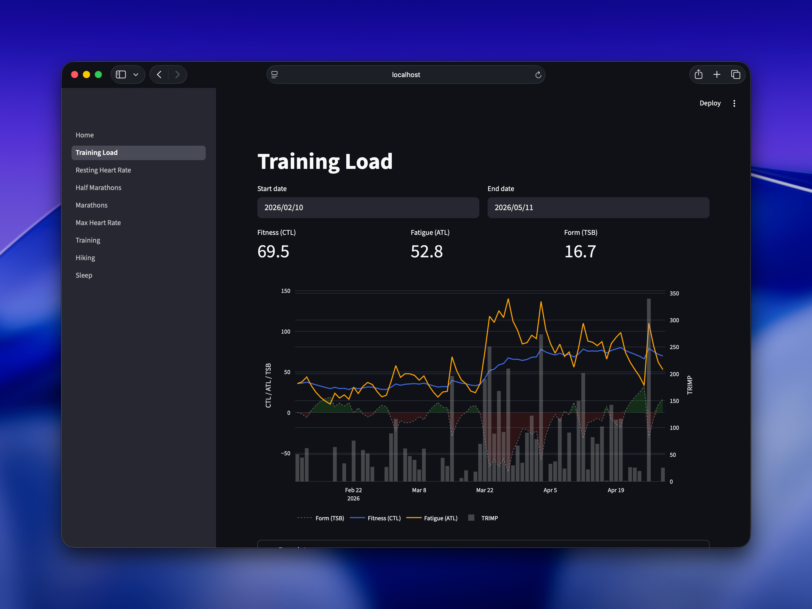

# fitter-happier

A fast, local-first fitness dashboard. Pulls data from Apple Health and
Strava exports, stores everything in [DuckDB](https://duckdb.org), and visualizes it with [Streamlit](https://streamlit.io).

Built for people who want to ask their own questions about their own data —
without giving it to anyone else.



## What it does

- **Ingests** Apple Health XML exports and Strava bulk archives
- **Normalizes** workouts, GPS routes, heart rate samples, sleep, HRV, VO2max,
  and resting heart rate into a local [DuckDB](https://duckdb.org) database
- **Enriches** with historical weather (Open-Meteo, no API key needed) and
  computed training load (CTL/ATL/TSB)
- **Visualizes** through a Streamlit dashboard with pages for:
  - Training load (fitness/fatigue/form)
  - Resting heart rate trends
  - Half marathon and marathon race history + mile splits
  - Max heart rate trends
  - Training overview
  - Hiking
  - Sleep (nightly trends, stage breakdown, correlated factors)

## Design philosophy

The data layer is the investment; the UI is disposable. Schema changes are
expensive — chart changes are not. All data stays local on your machine.

## Requirements

- Python 3.11+
- [uv](https://docs.astral.sh/uv/) for dependency management

## Quick start

```bash
# Install dependencies
uv sync

# Ingest an Apple Health export
uv run python -m src.ingest.apple_health ~/fitness-data/raw/export.zip

# (Optional) Ingest a Strava bulk export
uv run python -m src.ingest.strava ~/fitness-data/raw/strava-export.zip

# Enrich with weather + training load
uv run python -m src.enrich.weather
uv run python -m src.enrich.training_load

# Launch the dashboard
uv run streamlit run src/app/Home.py
# → opens at http://localhost:8501
```

## Data stays local

Your health data never leaves your machine. The only external call is to
[Open-Meteo](https://open-meteo.com/) for historical weather — free, no API key,
no account. Everything else runs entirely offline.

## Make it yours with a coding agent

The dashboard pages are just Python files — easy to add, remove, or rewrite.
The best way to extend this project is to point a coding agent (Claude Code,
Codex, Cursor, etc.) at your local clone and ask it to build the panels
you actually care about.

The `CLAUDE.md` file in the repo gives any agent the context it needs to
contribute immediately: where data lives, how the schema works, and what
conventions to follow.

**Example prompts to get started:**

> "Add a page showing my monthly running mileage vs. my resting heart rate,
> and highlight months where I peaked in mileage. Use the existing
> training\_load and health\_metrics tables."

> "Create a page that compares my pace and heart rate at different
> temperatures. I want to see whether I run slower when it's hot."

> "Build a strength training page that shows weekly session frequency
> and flags weeks where I skipped it during a marathon build."

The agent will read `DESIGN.md` to understand the architecture, query the
DuckDB schema directly, and write a new page in `src/app/pages/` — usually
in one shot.

## Architecture

```
Apple Health XML / Strava archive
        │
        ▼
   ingest layer          → normalize raw exports
        │
        ▼
   [DuckDB](https://duckdb.org) (local file) → single source of truth
        │
        ▼
   enrich layer          → weather, training load
        │
        ▼
   Streamlit app         → pages are cheap to add/remove
```

See [DESIGN.md](./DESIGN.md) for full architecture details.

## License

MIT
